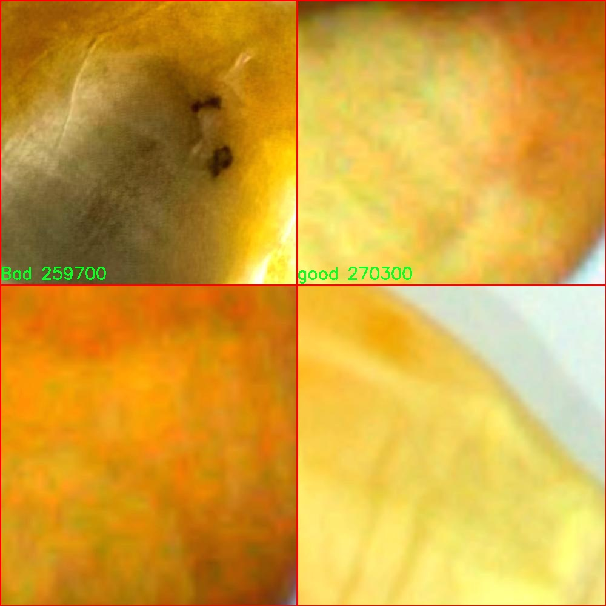

# 玉米种子质量检测检测系统源码分享
 # [一条龙教学YOLOV8标注好的数据集一键训练_70+全套改进创新点发刊_Web前端展示]

### 1.研究背景与意义

项目参考[AAAI Association for the Advancement of Artificial Intelligence](https://gitee.com/qunshansj/projects)

项目来源[AACV Association for the Advancement of Computer Vision](https://gitee.com/qunmasj/projects)

研究背景与意义

随着全球人口的不断增长，粮食安全问题日益凸显，农业生产的效率和质量成为了各国政府和科研机构关注的重点。在这一背景下，玉米作为全球重要的粮食作物之一，其种子的质量直接影响到作物的产量和品质。因此，开发高效、准确的玉米种子质量检测系统具有重要的现实意义和应用价值。传统的玉米种子质量检测方法多依赖人工目测和简单的物理检验，这不仅耗时耗力，而且容易受到人为因素的影响，导致检测结果的准确性和一致性不足。

近年来，计算机视觉和深度学习技术的迅猛发展为农业领域的智能化提供了新的机遇。YOLO（You Only Look Once）系列目标检测算法因其高效性和实时性，已广泛应用于各类物体检测任务中。YOLOv8作为该系列的最新版本，具备更强的特征提取能力和更快的处理速度，能够在复杂环境中实现高精度的目标检测。因此，基于改进YOLOv8的玉米种子质量检测系统的研究，能够有效提升玉米种子质量检测的自动化水平和准确性，进而为农业生产提供有力支持。

本研究所使用的数据集包含2900张玉米种子的图像，涵盖了三类种子：良种（good）、坏种（bad）和破损种子（broken）。这一数据集的多样性和丰富性为模型的训练和验证提供了坚实的基础。通过对不同类别种子的特征进行深入分析，改进YOLOv8模型的检测能力，使其能够在实际应用中更好地适应不同种子的外观变化和环境干扰，从而提高检测的准确率和鲁棒性。

此外，玉米种子质量检测系统的研究不仅限于技术层面的突破，更具有广泛的社会经济意义。通过提高种子质量检测的效率和准确性，可以有效减少因种子质量问题导致的农业损失，提升农作物的产量和品质，进而促进农民收入的增加和农业可持续发展。同时，该系统的推广应用也有助于推动农业智能化的发展，提升整个农业产业链的现代化水平。

综上所述，基于改进YOLOv8的玉米种子质量检测系统的研究，不仅在技术上具有重要的创新意义，更在推动农业现代化、保障粮食安全和促进经济发展等方面具有深远的影响。通过本研究的深入开展，期望能够为玉米种子的质量控制提供一种高效、可靠的解决方案，为实现农业的智能化转型贡献力量。

### 2.图片演示


##### 注意：由于此博客编辑较早，上面“2.图片演示”和“3.视频演示”展示的系统图片或者视频可能为老版本，新版本在老版本的基础上升级如下：（实际效果以升级的新版本为准）

  （1）适配了YOLOV8的“目标检测”模型和“实例分割”模型，通过加载相应的权重（.pt）文件即可自适应加载模型。

  （2）支持“图片识别”、“视频识别”、“摄像头实时识别”三种识别模式。

  （3）支持“图片识别”、“视频识别”、“摄像头实时识别”三种识别结果保存导出，解决手动导出（容易卡顿出现爆内存）存在的问题，识别完自动保存结果并导出到tempDir中。

  （4）支持Web前端系统中的标题、背景图等自定义修改，后面提供修改教程。

  另外本项目提供训练的数据集和训练教程,暂不提供权重文件（best.pt）,需要您按照教程进行训练后实现图片演示和Web前端界面演示的效果。

### 3.视频演示

[3.1 视频演示](https://www.bilibili.com/video/BV1Qk4ZeCEtT/)

### 4.数据集信息展示

##### 4.1 本项目数据集详细数据（类别数＆类别名）

nc: 3
names: ['Bad', 'broken', 'good']


##### 4.2 本项目数据集信息介绍

数据集信息展示

在本研究中，我们使用的“Corn seeds”数据集专门设计用于训练和改进YOLOv8模型，以实现高效的玉米种子质量检测。该数据集包含三种主要类别，分别为“Bad”（劣质）、“broken”（破损）和“good”（优质），这些类别的划分为玉米种子的质量评估提供了明确的标准。通过对这三类种子的特征进行深入分析和标注，我们能够有效地训练模型，使其具备较强的识别能力，从而在实际应用中提高玉米种子的筛选效率。

“Corn seeds”数据集的构建过程包括了对大量玉米种子的拍摄和标注。为了确保数据的多样性和代表性，数据集中的样本来自不同的生长环境和气候条件，涵盖了各种可能影响种子质量的因素。这种多样性不仅增强了模型的泛化能力，也为后续的研究提供了丰富的实验基础。每个类别的样本数量经过精心设计，以确保模型在训练过程中能够获得足够的样本支持，从而提高分类的准确性和鲁棒性。

在数据预处理阶段，我们对图像进行了标准化处理，包括调整图像尺寸、增强对比度和亮度等，以确保输入数据的一致性。此外，为了提高模型的训练效率，我们还采用了数据增强技术，如随机裁剪、旋转和翻转等。这些技术的应用使得模型在面对不同角度和光照条件下的种子图像时，能够保持较高的识别率。

数据集的标注工作是一个至关重要的环节。我们采用了专业的标注工具，对每一张图像中的种子进行精确的框选和分类。标注人员经过严格培训，确保每个类别的定义和特征得到准确理解，从而提高标注的一致性和准确性。这种高质量的标注为YOLOv8模型的训练提供了坚实的基础，使其能够在实际应用中快速而准确地识别不同质量的玉米种子。

在模型训练过程中，我们采用了交叉验证的方法，以评估模型在不同数据集划分下的表现。这种方法不仅可以有效防止过拟合，还能确保模型在实际应用中的可靠性。通过不断调整模型参数和优化算法，我们力求在检测精度和速度之间找到最佳平衡，从而实现实时的玉米种子质量检测。

总之，“Corn seeds”数据集为改进YOLOv8的玉米种子质量检测系统提供了丰富的样本和坚实的理论基础。通过对数据集的精心设计和处理，我们期望能够显著提升模型的检测性能，为农业生产中的种子质量管理提供有力支持。这一研究不仅具有重要的学术价值，也为实际农业生产中的智能化管理提供了可行的解决方案。





### 5.全套项目环境部署视频教程（零基础手把手教学）

[5.1 环境部署教程链接（零基础手把手教学）](https://www.ixigua.com/7404473917358506534?logTag=c807d0cbc21c0ef59de5)


[5.2 安装Python虚拟环境创建和依赖库安装视频教程链接（零基础手把手教学）](https://www.ixigua.com/7404474678003106304?logTag=1f1041108cd1f708b01a)

### 6.手把手YOLOV8训练视频教程（零基础小白有手就能学会）

[6.1 手把手YOLOV8训练视频教程（零基础小白有手就能学会）](https://www.ixigua.com/7404477157818401292?logTag=d31a2dfd1983c9668658)

### 7.70+种全套YOLOV8创新点代码加载调参视频教程（一键加载写好的改进模型的配置文件）

[7.1 70+种全套YOLOV8创新点代码加载调参视频教程（一键加载写好的改进模型的配置文件）](https://www.ixigua.com/7404478314661806627?logTag=29066f8288e3f4eea3a4)

### 8.70+种全套YOLOV8创新点原理讲解（非科班也可以轻松写刊发刊，V10版本正在科研待更新）

由于篇幅限制，每个创新点的具体原理讲解就不一一展开，具体见下列网址中的创新点对应子项目的技术原理博客网址【Blog】：


[8.1 70+种全套YOLOV8创新点原理讲解链接](https://gitee.com/qunmasj/good)

### 9.系统功能展示（检测对象为举例，实际内容以本项目数据集为准）

图9.1.系统支持检测结果表格显示

  图9.2.系统支持置信度和IOU阈值手动调节

  图9.3.系统支持自定义加载权重文件best.pt(需要你通过步骤5中训练获得)

  图9.4.系统支持摄像头实时识别

  图9.5.系统支持图片识别

  图9.6.系统支持视频识别

  图9.7.系统支持识别结果文件自动保存

  图9.8.系统支持Excel导出检测结果数据


### 10.原始YOLOV8算法原理

原始YOLOv8算法原理

YOLOv8算法是计算机视觉领域中一种先进的目标检测模型，由Glenn-Jocher提出，继承了YOLO系列的优良传统，特别是YOLOv3和YOLOv5的设计理念。自2015年YOLO模型首次问世以来，经过多次迭代，YOLOv8在推理速度、检测精度、训练便利性以及硬件兼容性等方面都取得了显著的提升，使其成为业界广泛应用的主流算法之一。

YOLOv8的网络结构主要由三个部分组成：Backbone（骨干网络）、Neck（颈部结构）和Head（头部结构）。其中，Backbone负责特征提取，Neck用于特征融合，而Head则通过解耦的方式输出检测结果。与之前的版本相比，YOLOv8在骨干网络中采用了C2f模块替代了YOLOv5中的C3模块，这一改进使得网络在特征提取时能够获得更丰富的梯度流动信息，从而提升了模型的整体性能。

在数据预处理方面，YOLOv8依然延续了YOLOv5的策略，采用了多种数据增强技术，如马赛克增强、混合增强、空间扰动和颜色扰动等。这些增强手段不仅丰富了训练数据的多样性，还有效提升了模型的鲁棒性，使其在面对不同场景和光照条件时，依然能够保持较高的检测精度。

YOLOv8的特征融合部分采用了FPN（Feature Pyramid Network）和PAN（Path Aggregation Network）的结合结构，这一设计使得多尺度信息能够得到充分的融合，进一步提升了对不同尺度目标的检测能力。通过在Neck部分引入C2f模块，YOLOv8能够更好地处理特征图之间的关系，确保语义信息和定位信息的有效传递。

在检测模块中，YOLOv8采用了解耦头的结构，这一设计的灵感来源于YOLOX。解耦头将分类和定位任务分为两个独立的分支，分别通过1×1卷积进行处理，这种分离的方式不仅提高了模型的收敛速度，还使得模型在处理复杂场景时能够更为精准地识别目标。YOLOv8的检测头结构使得网络能够更好地关注高质量的正样本，同时有效抑制负样本对损失的影响，从而优化了整体的检测性能。

在标签分配策略方面，YOLOv8引入了TOOD（Task-Oriented Object Detection）策略，替代了YOLOv5中的候选框聚类方法。TOOD策略的动态标签分配机制使得模型能够根据实际情况自适应地调整正负样本的匹配，确保不同尺度的目标都能得到合理的处理。这一策略的实施，使得YOLOv8在处理复杂数据集时，能够有效降低样本不均衡带来的负面影响。

此外，YOLOv8在损失函数的设计上也进行了创新，采用了Varifocal Loss（VFL）作为分类损失，结合CIoU Loss和DFL Loss作为回归损失。VFL通过不对称参数对正负样本进行加权，提升了模型对高质量样本的关注度，从而在训练过程中更有效地提升了检测精度。这种针对性较强的损失设计，使得YOLOv8在多种目标检测任务中表现出色。

综上所述，YOLOv8算法通过对骨干网络、特征融合、检测头和标签分配策略等多个方面的优化，显著提升了目标检测的精度和速度。其灵活的结构设计和高效的训练策略，使得YOLOv8在实际应用中展现出强大的适应性和优越性，成为当前目标检测领域的一个重要里程碑。随着YOLOv8的广泛应用，未来的研究和开发将进一步推动目标检测技术的进步，为计算机视觉领域带来更多的创新与突破。


### 11.项目核心源码讲解（再也不用担心看不懂代码逻辑）

#### 11.1 code\model.py

以下是经过精简和注释的核心代码部分：

```python
# -*- coding: utf-8 -*-
import cv2  # 导入OpenCV库，用于处理图像和视频
import torch
from QtFusion.models import Detector  # 从QtFusion库中导入Detector抽象基类
from ultralytics import YOLO  # 从ultralytics库中导入YOLO类，用于加载YOLO模型
from ultralytics.utils.torch_utils import select_device  # 从ultralytics库中导入select_device函数，用于选择设备
from chinese_name_list import Chinese_name  # 从datasets库中导入Chinese_name字典，用于获取类别的中文名称

# 选择设备：如果有可用的GPU，则使用GPU，否则使用CPU
device = "cuda:0" if torch.cuda.is_available() else "cpu"

# 初始化参数
ini_params = {
    'device': device,  # 设备类型
    'conf': 0.25,  # 物体置信度阈值
    'iou': 0.5,  # 非极大值抑制的IOU阈值
    'classes': None,  # 类别过滤器
    'verbose': False
}

class Web_Detector(Detector):  # 定义YOLOv8Detector类，继承自Detector类
    def __init__(self, params=None):  # 构造函数
        super().__init__(params)  # 调用父类构造函数
        self.model = None  # 初始化模型为None
        self.names = list(Chinese_name.values())  # 获取所有类别的中文名称
        self.params = params if params else ini_params  # 使用提供的参数或默认参数

    def load_model(self, model_path):  # 加载模型的方法
        self.device = select_device(self.params['device'])  # 选择设备
        task = 'segment' if os.path.basename(model_path)[:3] == 'seg' else 'detect'  # 根据模型文件名确定任务类型
        self.model = YOLO(model_path, task=task)  # 加载YOLO模型
        names_dict = self.model.names  # 获取类别名称字典
        # 将类别名称转换为中文
        self.names = [Chinese_name[v] if v in Chinese_name else v for v in names_dict.values()]  
        # 预热模型
        self.model(torch.zeros(1, 3, *[self.imgsz] * 2).to(self.device).type_as(next(self.model.model.parameters())))

    def predict(self, img):  # 预测方法
        results = self.model(img, **ini_params)  # 使用模型进行预测
        return results  # 返回预测结果

    def postprocess(self, pred):  # 后处理方法
        results = []  # 初始化结果列表
        for res in pred[0].boxes:  # 遍历预测结果中的每个边界框
            for box in res:
                class_id = int(box.cls.cpu())  # 获取类别ID
                bbox = box.xyxy.cpu().squeeze().tolist()  # 获取边界框坐标
                bbox = [int(coord) for coord in bbox]  # 转换为整数

                result = {
                    "class_name": self.names[class_id],  # 类别名称
                    "bbox": bbox,  # 边界框
                    "score": box.conf.cpu().squeeze().item(),  # 置信度
                    "class_id": class_id,  # 类别ID
                    "mask": pred[0].masks[0].xy if pred[0].masks is not None else None  # 掩膜信息
                }
                results.append(result)  # 添加结果到列表
        return results  # 返回结果列表
```

### 代码分析
1. **设备选择**：根据是否有可用的GPU来选择计算设备。
2. **参数初始化**：设置YOLO模型的相关参数，包括置信度阈值和IOU阈值。
3. **模型加载**：根据模型路径加载YOLO模型，并将类别名称转换为中文。
4. **预测功能**：使用加载的模型对输入图像进行预测，并返回结果。
5. **后处理**：对预测结果进行处理，提取类别名称、边界框、置信度等信息，并将其组织成字典形式返回。

该代码的核心功能是实现YOLO模型的加载、预测和结果处理，适用于目标检测任务。

这个文件是一个用于目标检测的Python模块，主要使用了YOLO（You Only Look Once）模型和OpenCV库。文件的结构包括导入必要的库、定义一些参数、实现一个检测器类以及相关的方法。

首先，文件导入了OpenCV库用于图像和视频处理，Torch库用于深度学习模型的操作，QtFusion库中的Detector和HeatmapGenerator类，以及Ultralytics库中的YOLO类和select_device函数。还引入了一个中文名称字典，用于将检测到的类别名称转换为中文。

接下来，定义了一些初始化参数，包括设备类型（使用CUDA或CPU）、物体置信度阈值、IOU阈值和类别过滤器等。这些参数将用于后续的模型推理和处理。

文件中定义了一个名为`count_classes`的函数，用于统计检测结果中每个类别的数量。该函数接收检测信息和类别名称列表，返回一个包含每个类别数量的列表。

然后，定义了一个名为`Web_Detector`的类，继承自`Detector`类。这个类的构造函数初始化了一些属性，包括模型、图像和类别名称。`load_model`方法用于加载YOLO模型，并根据模型路径判断任务类型（检测或分割）。在加载模型后，它还会将类别名称转换为中文，并进行模型的预热。

`preprocess`方法用于对输入图像进行预处理，当前实现仅保存原始图像并返回。`predict`方法则调用模型进行预测，返回预测结果。`postprocess`方法用于处理模型的输出，将检测到的目标信息（类别名称、边界框、置信度等）整理成字典并返回一个结果列表。

最后，`set_param`方法允许更新检测器的参数，以便在运行时动态调整检测设置。

整体来看，这个模块实现了一个基于YOLO模型的目标检测器，能够加载模型、处理图像、进行预测并返回检测结果，适用于需要进行实时目标检测的应用场景。

#### 11.2 code\ultralytics\data\explorer\__init__.py

以下是保留的核心代码部分，并附上详细的中文注释：

```python
# 导入Ultralytics YOLO库中的plot_query_result函数
from .utils import plot_query_result

# 定义模块的公开接口，只有plot_query_result函数可以被外部访问
__all__ = ["plot_query_result"]
```

### 代码注释说明：
1. `from .utils import plot_query_result`：这一行代码从当前模块的`utils`子模块中导入了`plot_query_result`函数。这个函数可能用于绘制查询结果，具体功能依赖于`utils`模块的实现。

2. `__all__ = ["plot_query_result"]`：这一行代码定义了模块的公开接口。`__all__`是一个特殊的变量，用于指定当使用`from module import *`语句时，哪些名称会被导入。在这里，只有`plot_query_result`函数会被导入，其他未列出的名称将不会被导入，这有助于控制模块的命名空间，避免不必要的名称冲突。

这个程序文件是一个Python模块的初始化文件，位于`code/ultralytics/data/explorer/`目录下。文件的第一行是一个注释，说明这个项目是Ultralytics YOLO（一个流行的目标检测模型），并且该项目遵循AGPL-3.0许可证。

接下来的代码从同一目录下的`utils`模块中导入了一个名为`plot_query_result`的函数或类。这意味着在这个模块中，我们可以使用`plot_query_result`这个功能。

最后，`__all__`是一个特殊的变量，用于定义当使用`from module import *`语句时，哪些名称会被导入。在这里，`__all__`被设置为一个包含`plot_query_result`的列表，这意味着只有这个名称会被导入，而其他未列出的名称则不会被导入。

总体来说，这个文件的主要作用是为模块提供初始化功能，并指定可供外部使用的接口。

#### 11.3 ui.py

以下是保留的核心代码部分，并附上详细的中文注释：

```python
import sys
import subprocess

def run_script(script_path):
    """
    使用当前 Python 环境运行指定的脚本。

    Args:
        script_path (str): 要运行的脚本路径

    Returns:
        None
    """
    # 获取当前 Python 解释器的路径
    python_path = sys.executable

    # 构建运行命令，使用 streamlit 运行指定的脚本
    command = f'"{python_path}" -m streamlit run "{script_path}"'

    # 执行命令
    result = subprocess.run(command, shell=True)
    # 检查命令执行结果，如果返回码不为0，则表示出错
    if result.returncode != 0:
        print("脚本运行出错。")

# 实例化并运行应用
if __name__ == "__main__":
    # 指定要运行的脚本路径
    script_path = "web.py"  # 这里可以替换为实际的脚本路径

    # 调用函数运行脚本
    run_script(script_path)
```

### 代码注释说明：
1. **导入模块**：
   - `sys`：用于获取当前 Python 解释器的路径。
   - `subprocess`：用于执行外部命令。

2. **`run_script` 函数**：
   - 接受一个参数 `script_path`，表示要运行的 Python 脚本的路径。
   - 使用 `sys.executable` 获取当前 Python 解释器的路径，以确保使用正确的 Python 环境。
   - 构建一个命令字符串，使用 `streamlit` 模块运行指定的脚本。
   - 使用 `subprocess.run` 执行构建的命令，并通过 `shell=True` 允许在 shell 中执行。
   - 检查命令的返回码，如果不为0，表示脚本运行出错，打印错误信息。

3. **主程序块**：
   - 在脚本被直接运行时，指定要运行的脚本路径（这里为 `web.py`）。
   - 调用 `run_script` 函数来执行指定的脚本。

这个程序文件名为 `ui.py`，主要功能是通过当前的 Python 环境来运行一个指定的脚本，具体是使用 Streamlit 来启动一个 Web 应用。

程序首先导入了必要的模块，包括 `sys`、`os` 和 `subprocess`，这些模块分别用于获取系统信息、操作文件系统和执行外部命令。此外，还导入了 `abs_path` 函数，这个函数来自 `QtFusion.path` 模块，可能用于获取文件的绝对路径。

接下来，定义了一个名为 `run_script` 的函数，该函数接受一个参数 `script_path`，表示要运行的脚本的路径。在函数内部，首先获取当前 Python 解释器的路径，存储在 `python_path` 变量中。然后，构建一个命令字符串 `command`，这个命令使用当前的 Python 解释器来运行指定的脚本，并且使用 Streamlit 进行启动。

使用 `subprocess.run` 方法来执行构建好的命令，`shell=True` 参数允许在 shell 中执行命令。执行后，检查命令的返回码，如果返回码不为 0，表示脚本运行出错，程序会打印出错误信息。

在文件的最后部分，使用 `if __name__ == "__main__":` 来确保当该文件作为主程序运行时，下面的代码才会被执行。在这里，指定了要运行的脚本路径 `script_path`，通过调用 `abs_path` 函数来获取 `web.py` 的绝对路径。最后，调用 `run_script` 函数来执行这个脚本。

整体来看，这个程序的主要作用是方便用户通过命令行启动一个 Streamlit Web 应用，且能够处理脚本运行中的错误。

#### 11.4 train.py

以下是经过简化和注释的核心代码部分，主要集中在 YOLO 模型的训练过程中：

```python
import random
import numpy as np
import torch.nn as nn
from ultralytics.data import build_dataloader, build_yolo_dataset
from ultralytics.engine.trainer import BaseTrainer
from ultralytics.models import yolo
from ultralytics.nn.tasks import DetectionModel
from ultralytics.utils import LOGGER, RANK
from ultralytics.utils.torch_utils import de_parallel, torch_distributed_zero_first

class DetectionTrainer(BaseTrainer):
    """
    扩展 BaseTrainer 类的检测模型训练类。
    """

    def build_dataset(self, img_path, mode="train", batch=None):
        """
        构建 YOLO 数据集。

        参数:
            img_path (str): 包含图像的文件夹路径。
            mode (str): 模式，可以是 'train' 或 'val'，用于自定义不同的增强方式。
            batch (int, optional): 批量大小，仅用于 'rect' 模式。
        """
        gs = max(int(de_parallel(self.model).stride.max() if self.model else 0), 32)  # 获取模型的最大步幅
        return build_yolo_dataset(self.args, img_path, batch, self.data, mode=mode, rect=mode == "val", stride=gs)

    def get_dataloader(self, dataset_path, batch_size=16, rank=0, mode="train"):
        """构造并返回数据加载器。"""
        assert mode in ["train", "val"]  # 确保模式有效
        with torch_distributed_zero_first(rank):  # 在分布式训练中，仅初始化一次数据集
            dataset = self.build_dataset(dataset_path, mode, batch_size)
        shuffle = mode == "train"  # 训练模式下打乱数据
        workers = self.args.workers if mode == "train" else self.args.workers * 2  # 设置工作线程数
        return build_dataloader(dataset, batch_size, workers, shuffle, rank)  # 返回数据加载器

    def preprocess_batch(self, batch):
        """对图像批次进行预处理，包括缩放和转换为浮点数。"""
        batch["img"] = batch["img"].to(self.device, non_blocking=True).float() / 255  # 将图像转换为浮点数并归一化
        if self.args.multi_scale:  # 如果启用多尺度训练
            imgs = batch["img"]
            sz = (
                random.randrange(self.args.imgsz * 0.5, self.args.imgsz * 1.5 + self.stride)
                // self.stride
                * self.stride
            )  # 随机选择图像大小
            sf = sz / max(imgs.shape[2:])  # 计算缩放因子
            if sf != 1:
                ns = [
                    math.ceil(x * sf / self.stride) * self.stride for x in imgs.shape[2:]
                ]  # 计算新的图像形状
                imgs = nn.functional.interpolate(imgs, size=ns, mode="bilinear", align_corners=False)  # 进行插值
            batch["img"] = imgs  # 更新批次图像
        return batch

    def get_model(self, cfg=None, weights=None, verbose=True):
        """返回 YOLO 检测模型。"""
        model = DetectionModel(cfg, nc=self.data["nc"], verbose=verbose and RANK == -1)  # 创建检测模型
        if weights:
            model.load(weights)  # 加载预训练权重
        return model

    def plot_training_samples(self, batch, ni):
        """绘制带有注释的训练样本。"""
        plot_images(
            images=batch["img"],
            batch_idx=batch["batch_idx"],
            cls=batch["cls"].squeeze(-1),
            bboxes=batch["bboxes"],
            paths=batch["im_file"],
            fname=self.save_dir / f"train_batch{ni}.jpg",
            on_plot=self.on_plot,
        )

    def plot_metrics(self):
        """从 CSV 文件中绘制指标。"""
        plot_results(file=self.csv, on_plot=self.on_plot)  # 保存结果图
```

### 代码说明：
1. **DetectionTrainer 类**：继承自 `BaseTrainer`，用于训练 YOLO 检测模型。
2. **build_dataset 方法**：根据给定的图像路径和模式构建数据集，支持训练和验证模式。
3. **get_dataloader 方法**：构造数据加载器，支持分布式训练。
4. **preprocess_batch 方法**：对输入的图像批次进行预处理，包括归一化和可能的缩放。
5. **get_model 方法**：返回一个 YOLO 检测模型，并可选择加载预训练权重。
6. **plot_training_samples 方法**：绘制训练样本及其注释，便于可视化。
7. **plot_metrics 方法**：从 CSV 文件中绘制训练过程中的指标，以便分析训练效果。

这个程序文件 `train.py` 是一个用于训练 YOLO（You Only Look Once）目标检测模型的脚本，继承自 `BaseTrainer` 类。程序的主要功能是构建数据集、创建数据加载器、预处理图像、设置模型属性、获取模型、进行验证、记录损失、显示训练进度、绘制训练样本和绘制训练指标等。

在文件开头，导入了一些必要的库和模块，包括数学运算、随机数生成、深度学习框架 PyTorch 的神经网络模块，以及 Ultralytics 提供的相关工具和函数。接着定义了 `DetectionTrainer` 类，这个类是专门为目标检测任务设计的。

`build_dataset` 方法用于构建 YOLO 数据集。它接收图像路径、模式（训练或验证）和批次大小作为参数，并根据模型的步幅（stride）来设置数据集的构建方式。

`get_dataloader` 方法则用于构建数据加载器。它会根据模式（训练或验证）来初始化数据集，并设置是否打乱数据的顺序。对于训练模式，数据会被打乱，而在验证模式下则不会。

`preprocess_batch` 方法负责对一批图像进行预处理，包括将图像缩放到合适的大小并转换为浮点数格式。该方法还支持多尺度训练，通过随机选择图像的大小来增强模型的鲁棒性。

`set_model_attributes` 方法用于设置模型的属性，包括类别数量和类别名称等。这些信息对于模型的训练和评估至关重要。

`get_model` 方法用于返回一个 YOLO 检测模型的实例，并可以加载预训练的权重。

`get_validator` 方法返回一个用于验证 YOLO 模型的验证器，这个验证器可以在训练过程中评估模型的性能。

`label_loss_items` 方法用于返回带有标签的训练损失项字典，这对于目标检测任务是必要的，因为它需要记录不同类型的损失（如边界框损失、类别损失等）。

`progress_string` 方法返回一个格式化的字符串，用于显示训练进度，包括当前的 epoch、GPU 内存使用情况、损失值、实例数量和图像大小等信息。

`plot_training_samples` 方法用于绘制训练样本及其标注，帮助可视化训练过程中的数据。

最后，`plot_metrics` 和 `plot_training_labels` 方法分别用于绘制训练指标和创建带标签的训练图，帮助用户分析模型的训练效果。

总体而言，这个程序文件实现了 YOLO 模型训练的核心功能，提供了从数据准备到模型训练和评估的完整流程。

#### 11.5 70+种YOLOv8算法改进源码大全和调试加载训练教程（非必要）\ultralytics\models\yolo\__init__.py

以下是保留的核心代码部分，并添加了详细的中文注释：

```python
# 导入Ultralytics YOLO库中的分类、检测、姿态估计和分割功能
from ultralytics.models.yolo import classify, detect, pose, segment

# 从当前模块导入YOLO模型
from .model import YOLO

# 定义当前模块公开的接口，包含分类、分割、检测、姿态估计功能和YOLO模型
__all__ = 'classify', 'segment', 'detect', 'pose', 'YOLO'
```

### 注释说明：
1. **导入功能**：
   - `classify`：用于图像分类的功能。
   - `detect`：用于目标检测的功能。
   - `pose`：用于姿态估计的功能。
   - `segment`：用于图像分割的功能。

2. **YOLO模型**：
   - `YOLO`：自定义的YOLO模型，可能包含特定的实现或扩展。

3. **`__all__`变量**：
   - 该变量定义了当前模块公开的接口，用户在使用`from module import *`时，将只会导入这些指定的功能和类。这有助于控制模块的可见性和使用方式。

这个程序文件是Ultralytics YOLO（You Only Look Once）算法的一部分，主要用于模型的导入和模块的组织。文件的开头有一个注释，说明这是Ultralytics YOLO的代码，并且提到该代码遵循AGPL-3.0许可证。

在代码中，首先从`ultralytics.models.yolo`模块中导入了四个功能：`classify`（分类）、`detect`（检测）、`pose`（姿态估计）和`segment`（分割）。这些功能是YOLO算法的不同应用场景，分别用于图像分类、目标检测、姿态估计和图像分割。

接着，从当前目录下的`model`模块中导入了`YOLO`类。这个类可能是YOLO模型的核心实现，负责模型的初始化、训练和推理等功能。

最后，`__all__`变量被定义为一个元组，包含了上述导入的所有功能和类。这意味着当使用`from module import *`语句时，只会导入这些指定的内容。这是一种良好的编程习惯，有助于控制模块的导出内容，避免不必要的命名冲突。

总体来说，这个文件的主要作用是组织和导入YOLO相关的功能和类，为后续的模型使用和扩展提供基础。

#### 11.6 code\ultralytics\models\yolo\obb\__init__.py

以下是保留的核心代码部分，并添加了详细的中文注释：

```python
# 导入所需的模块
from .predict import OBBPredictor  # 导入OBB预测器，用于目标检测
from .train import OBBTrainer      # 导入OBB训练器，用于模型训练
from .val import OBBValidator       # 导入OBB验证器，用于模型验证

# 定义模块的公开接口，指定可以被外部访问的类
__all__ = "OBBPredictor", "OBBTrainer", "OBBValidator"  # 公开OBBPredictor、OBBTrainer和OBBValidator
```

### 注释说明：
1. **模块导入**：代码首先从当前包中导入了三个类，分别用于预测、训练和验证。这些类是实现YOLO（You Only Look Once）目标检测模型的核心组件。
2. **公开接口**：`__all__` 变量定义了当使用 `from module import *` 时，哪些类会被导入。这是一种控制模块接口的方式，确保只有指定的类可以被外部访问。

这个程序文件是一个Python模块的初始化文件，位于Ultralytics YOLO项目的特定目录下，主要用于导入和管理与OBB（Oriented Bounding Box，定向边界框）相关的功能。

文件的第一行是一个注释，说明了该项目的名称（Ultralytics YOLO）以及其使用的许可证类型（AGPL-3.0）。这表明该项目是开源的，并且遵循特定的许可证条款。

接下来的几行代码通过相对导入的方式引入了三个类：`OBBPredictor`、`OBBTrainer`和`OBBValidator`。这些类分别用于不同的功能模块：`OBBPredictor`可能用于进行预测，`OBBTrainer`用于训练模型，而`OBBValidator`则用于验证模型的性能。

最后一行代码定义了`__all__`变量，它是一个列表，包含了模块中希望公开的类名。当使用`from module import *`语句时，只有在`__all__`中列出的名称会被导入。这有助于控制模块的公共接口，避免不必要的名称泄露。

总的来说，这个文件的主要作用是组织和导出与OBB相关的功能，使得其他模块可以方便地使用这些功能。

### 12.系统整体结构（节选）

### 整体功能和构架概括

该项目是一个基于YOLO（You Only Look Once）算法的目标检测框架，提供了多种功能，包括目标检测、图像分割、姿态估计和分类等。整体架构由多个模块组成，每个模块负责特定的功能。项目的设计使得用户可以方便地进行模型训练、验证和推理，同时也支持多种数据处理和可视化功能。

主要的功能模块包括：
- **模型定义与训练**：提供了YOLO模型的定义、训练和验证功能。
- **数据处理**：包括数据集的构建和数据加载器的管理。
- **可视化工具**：用于绘制训练样本和训练指标，帮助用户分析模型性能。
- **用户界面**：通过Streamlit提供的Web界面，方便用户进行交互和可视化。

以下是每个文件的功能整理表格：

| 文件路径                                                                                              | 功能描述                                                                                   |
|-----------------------------------------------------------------------------------------------------|------------------------------------------------------------------------------------------|
| `code\model.py`                                                                                     | 实现YOLO目标检测器，包括模型加载、预测和后处理功能。                                       |
| `code\ultralytics\data\explorer\__init__.py`                                                      | 模块初始化文件，导入数据可视化相关功能。                                                   |
| `ui.py`                                                                                             | 启动Streamlit Web应用的脚本，提供用户界面来运行目标检测模型。                             |
| `train.py`                                                                                          | 实现YOLO模型的训练过程，包括数据集构建、数据加载、模型训练和验证等功能。                  |
| `70+种YOLOv8算法改进源码大全和调试加载训练教程（非必要）\ultralytics\models\yolo\__init__.py` | 模块初始化文件，导入YOLO相关的分类、检测、姿态估计和分割功能。                             |
| `code\ultralytics\models\yolo\obb\__init__.py`                                                    | 模块初始化文件，导入与定向边界框（OBB）相关的功能，包括预测、训练和验证。                 |
| `70+种YOLOv8算法改进源码大全和调试加载训练教程（非必要）\ultralytics\models\yolo\detect\val.py`  | 实现YOLO目标检测模型的验证功能，评估模型在验证集上的性能。                                 |
| `70+种YOLOv8算法改进源码大全和调试加载训练教程（非必要）\ultralytics\models\fastsam\model.py`   | 实现FastSAM模型的定义和相关功能，可能用于快速分割或检测任务。                             |
| `70+种YOLOv8算法改进源码大全和调试加载训练教程（非必要）\ultralytics\utils\instance.py`         | 提供与实例分割相关的工具和功能，支持分割任务的实现。                                      |
| `code\ultralytics\models\yolo\segment\val.py`                                                    | 实现YOLO分割模型的验证功能，评估分割模型在验证集上的性能。                                 |
| `70+种YOLOv8算法改进源码大全和调试加载训练教程（非必要）\ultralytics\models\rtdetr\predict.py`  | 实现RTDETR模型的预测功能，可能用于实时目标检测任务。                                      |
| `code\ultralytics\utils\callbacks\comet.py`                                                       | 提供与Comet.ml集成的回调功能，用于监控和记录训练过程中的指标。                            |
| `70+种YOLOv8算法改进源码大全和调试加载训练教程（非必要）\ultralytics\models\yolo\classify\val.py` | 实现YOLO分类模型的验证功能，评估分类模型在验证集上的性能。                                 |

这个表格总结了各个文件的主要功能，帮助理解整个项目的结构和各个模块之间的关系。

注意：由于此博客编辑较早，上面“11.项目核心源码讲解（再也不用担心看不懂代码逻辑）”中部分代码可能会优化升级，仅供参考学习，完整“训练源码”、“Web前端界面”和“70+种创新点源码”以“13.完整训练+Web前端界面+70+种创新点源码、数据集获取”的内容为准。

### 13.完整训练+Web前端界面+70+种创新点源码、数据集获取


# [下载链接：https://mbd.pub/o/bread/ZpuUm55p](https://mbd.pub/o/bread/ZpuUm55p)